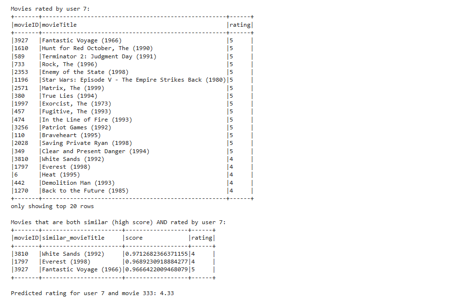

# Collaborative Filtering for Movie Recommendation Using Apache Spark

## Introduction
This repository contains the implementation of an **Item-Item Collaborative Filtering** movie recommendation system using **Apache Spark**. The system calculates cosine similarity between movies based on user ratings and recommends similar movies to users.

## Features
- **Item-Item Collaborative Filtering** to find movie similarities.
- **Cosine Similarity** calculation for movie pairs based on user ratings.
- Scalable and efficient processing using **Apache Spark**.

## Dataset
The project uses movie ratings data. You can use datasets like the **MovieLens** dataset, which includes:
- **userID**: The ID of the user who rated the movie.
- **movieID**: The ID of the movie.
- **rating**: The rating given by the user to the movie.
- **timestamp**: The timestamp of the rating.

## Installation

### Prerequisites:
- **Apache Spark** (v3.x or higher)
- **Python 3.x**
- **PySpark** library

### Results:

